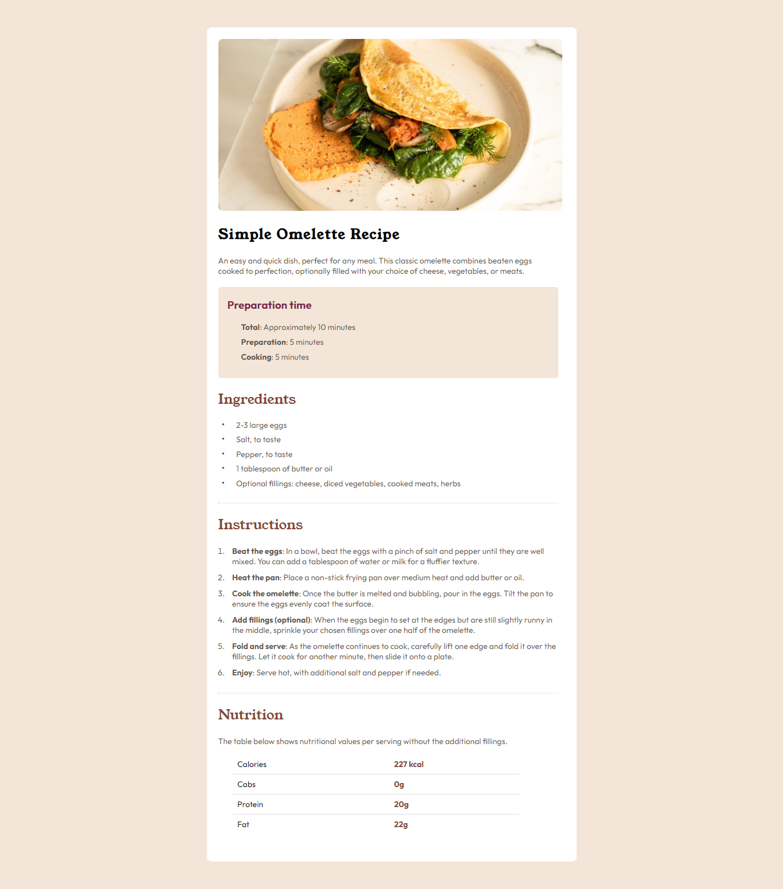

# Frontend Mentor - Recipe page solution

This is a solution to the [Recipe page challenge on Frontend Mentor](https://www.frontendmentor.io/challenges/recipe-page-KiTsR8QQKm). Frontend Mentor challenges help you improve your coding skills by building realistic projects. 

## Table of contents

- [Overview](#overview)
  - [The challenge](#the-challenge)
  - [Screenshot](#screenshot)
  - [Links](#links)
- [My process](#my-process)
  - [Built with](#built-with)
  - [What I learned](#what-i-learned)
  - [Continued development](#continued-development)
  - [Useful resources](#useful-resources)
- [Author](#author)
- [Acknowledgments](#acknowledgments)

## Overview

### Screenshot

### Links

- Solution URL: [(https://simple-omlette-recipe.netlify.app/)]
- Live Site URL: [(http://127.0.0.1:5500/index.html)]

## My process

### Built with

- Semantic HTML5 markup
- CSS custom properties
- CSS Pseudo elements
- Flexbox
- Media queries

### What I learned

I learnt how to change the color of a bullet in an unordered list. 

### Continued development

JavaScript

### Useful resources

- [(https://www.stackoverflow.com)] - This helped me for changing the color of unordered bullet points.

## Author

- Website - I don't have one yet.
- Frontend Mentor - [(https://www.frontendmentor.io/profile/jaameyaw)]
- Instagram - [(https://www.instagram.com/johnson_ameyaw)]

## Acknowledgments

Big ups to w3schools and stackoverflow

 
